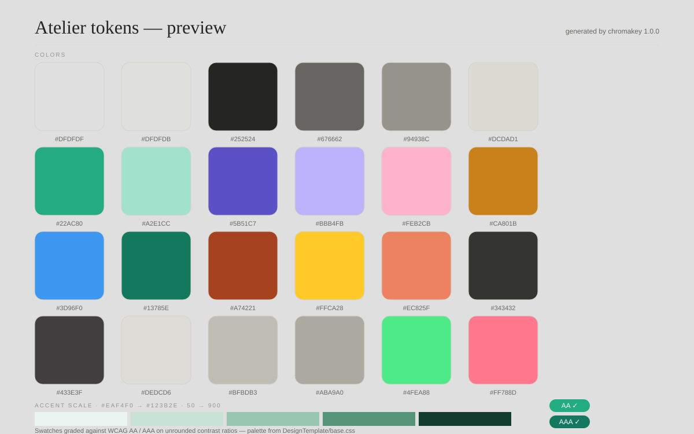

# Chromakey

A design-token compiler in one stdlib-only Python CLI — one JSON in, every framework out, WCAG-graded.

`python 3.9+` · `stdlib only` · `wcag` · `deterministic` · `mit`



## Why

Style Dictionary needs Node and a config file. Chromakey is a single stdlib-only Python CLI that runs wherever Python runs — the design-token compiler that fits in your README, not your package.json.

It is the only zero-dependency compiler that treats accessibility as a first-class output: every color pair is graded against WCAG AA/AAA *on the unrounded ratio* before the build finishes, and a self-contained `preview.html` specimen proves the palette on screen and in CI.

## Quickstart

No install required — the package is runnable in place:

```
python -m chromakey build tokens.json --all --out out
python -m chromakey contrast tokens.json --all --strict
python -m chromakey palette #22AC80 --steps 5
python -m chromakey validate tokens.json
python -m chromakey preview tokens.json
```

Prefer the console script? `pyproject.toml` registers `chromakey = "chromakey.cli:main"` as metadata — it is never parsed at runtime, and nothing here needs pip.

## Commands

| Command | What it does | Exit codes |
| --- | --- | --- |
| `build TOKENS [--format css\|scss\|tailwind\|json] [--out DIR] [--all]` | compiles the token file to CSS, SCSS, a Tailwind config, and flat JSON (default: all four into `--out`) | `0` ok · `1` data · `2` usage |
| `contrast TOKENS [--pairs a,b,a,b \| --all] [--strict]` | grades pairs against WCAG AA/AAA; `--all` = every color token vs white and black | `0` ok · `1` AA failure with `--strict` · `2` usage |
| `palette HEX [--steps 5]` | 50→900 HSL lightness ramp for a base hex (neutral-safe for low-saturation bases) | `0` · `1` bad hex · `2` usage |
| `validate TOKENS` | kebab-case names, ≥2 segments, strict hex values | `0` clean · `1` problems · `2` usage |
| `preview TOKENS [--out FILE]` | self-contained `preview.html` (default: `<TOKENS dir>/preview.html`) | `0` · `1` data · `2` usage |

Global flags: `-h/--help`, `--version`, `--quiet`, `--json` (machine-readable summary where applicable).

## Token formats

**DTCG** — detected by any `$value`; nested groups flatten to CTI names (`color.green` → `color-green`); unknown `$`-properties (`$type`, `$description`, …) are tolerated:

```json
{ "color": { "ink": { "$value": "#252524", "$type": "color" } } }
```

**Legacy** — flat plain values (Figma-style `{"value": "…"}` leaves work too):

```json
{ "color": { "ink": "#252524" } }
```

A file mixing the two formats is rejected with a clear `mixed formats` error. **Aliases**: a value that is exactly `{path.to.token}` (dots or hyphens) resolves recursively to a fixed point; multi-refs (`{a,b}`), cycles, and missing targets all raise errors naming the offending path.

## Contrast & CI

- `#767676` on white → `4.54:1` AA ✓; `#777777` on white → `4.48:1` AA ✗; black on white → `21.00:1`.
- Verdicts compare the **unrounded** ratio — `4.495` never display-passes as `4.50`; display rounds to 2 decimals only.
- `--strict` exits `1` when any pair fails AA (normal text), so `contrast tokens.json --all --strict` gates a CI step.
- Alpha hex (`#RRGGBBAA`) is rejected by the contrast math: WCAG contrast is undefined with alpha.

## Testing

```
python -m pytest tests -q
```

61 tests cover format detection (DTCG / legacy / mixed), alias resolution, cycles and missing refs, the WCAG boundary pairs and the unrounded-ratio rule, palette math, emitter determinism (two builds byte-identical), and CLI exit codes.

## Design

`sample/tokens.json` is the token set of the Atelier template (`DesignTemplate/tokens.json`): the same paper / ink / hairline values, so the generated outputs and `preview.html` look like the product they describe. `sample/legacy.json` exercises the legacy flat format.

## License

[MIT](LICENSE) — Copyright (c) 2026 adithyanraj03.
